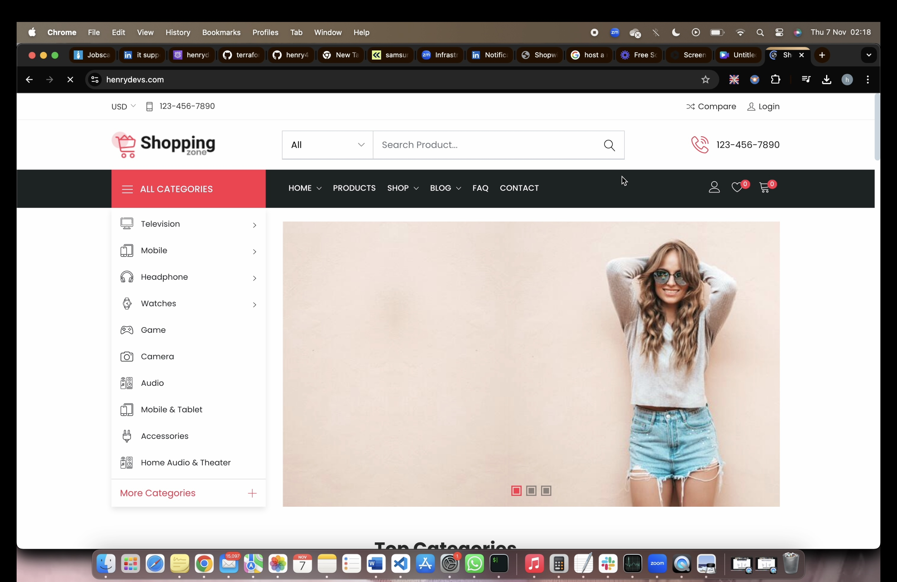

---



# E-commerce Infrastructure with Terraform and AWS

In today's competitive e-commerce landscape, a scalable and resilient infrastructure is essential to handle high traffic and ensure availability. By leveraging **AWS** and **Terraform**, you can automate the setup of a robust cloud architecture, enabling seamless scalability and security for your e-commerce platform. This project provides an infrastructure setup designed to meet these requirements, ensuring your application can scale dynamically and handle unpredictable spikes in demand.

## Table of Contents

- [Prerequisites](#prerequisites)
- [Project Overview](#project-overview)
- [Architecture](#architecture)
- [Setup Instructions](#setup-instructions)
- [Deployment](#deployment)
- [License](#license)

## Prerequisites

Before setting up this infrastructure, ensure you have the following tools installed:

1. **[Terraform](https://www.terraform.io/downloads.html)** - Infrastructure as Code (IaC) tool.
2. **[GitHub Account](https://github.com/)** - To store and manage the code repository.
3. **[Git](https://git-scm.com/)** - Version control for code management.
4. **[Visual Studio Code](https://code.visualstudio.com/)** - Recommended IDE for managing Terraform files.
5. **[AWS CLI](https://aws.amazon.com/cli/)** - For managing AWS services from the command line.
6. **AWS Account** - Required to provision resources on AWS.

## Project Overview

This project uses Terraform to automate the provisioning of a secure and highly available cloud infrastructure for an e-commerce website. The setup includes:

- **VPC with public and private subnets across two availability zones** for high availability.
- **NAT Gateways** to allow instances in private subnets to securely access the internet.
- **Security Groups** to control traffic to resources.
- **Amazon RDS (MySQL)** as the database backend.
- **Application Load Balancer (ALB)** to manage incoming traffic.
- **Auto Scaling Group** for EC2 instances to ensure scalability.
- **Amazon SNS** for notifications.
- **Route 53** for DNS management.

## Architecture


The infrastructure comprises the following components:

1. **VPC** - A custom Virtual Private Cloud with public and private subnets.
2. **NAT Gateway** - Ensures secure internet access for instances in private subnets.
3. **Security Groups** - Manages inbound and outbound rules for web servers and databases.
4. **RDS MySQL Database** - A highly available database with standby replication.
5. **Application Load Balancer** - Distributes incoming requests across EC2 instances.
6. **Auto Scaling Group** - Ensures dynamic scaling of EC2 instances based on demand.
7. **SNS Topic** - Notifies the administrator of any important system events.
8. **Route 53** - DNS management for website accessibility.

## Setup Instructions

### 1. Initial Setup

1. **Install Terraform** on your local machine.
2. **Sign up for a GitHub account** if you don’t already have one.
3. **Create a GitHub repository** to store the Terraform code.
4. **Install Git** for version control.
5. **Create SSH Keys** for GitHub access without a password.
6. **Clone the repository** and set up the project structure.
7. **Install VS Code** for managing the project files.

### 2. AWS Configuration

1. **Install AWS CLI** and configure it with your AWS account credentials.
2. **Set up a VPC** with public and private subnets in two availability zones.
3. **Configure NAT Gateways** in the public subnets for secure internet access.
4. **Set up Security Groups** to manage access to EC2 instances and RDS.
5. **Create an RDS MySQL instance** for database storage.
6. **Set up an Application Load Balancer** to manage incoming traffic across EC2 instances.
7. **Create an Auto Scaling Group** for EC2 instances to handle load dynamically.
8. **Create an SNS Topic** for system notifications.
9. **Configure Route 53** for DNS management.

## Deployment

1. **Clone the Repository**  
   ```bash
   git clone https://github.com/your-username/your-repo.git
   cd your-repo
   ```

2. **Initialize Terraform**  
   ```bash
   terraform init
   ```

3. **Plan the Deployment**  
   Review the infrastructure changes Terraform will make.
   ```bash
   terraform plan
   ```

4. **Apply the Changes**  
   Deploy the infrastructure by applying the configuration.
   ```bash
   terraform apply
   ```

5. **Verify**  
   Check the AWS Management Console to confirm the resources were created successfully.

## License

This project is licensed under the MIT License - see the [LICENSE](LICENSE) file for details.

---

